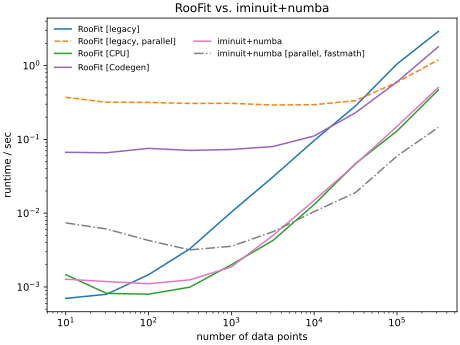

.. |iminuit| image:: doc/_static/iminuit_logo.svg
   :alt: iminuit

|iminuit|
=========

.. version-marker-do-not-remove

.. image:: https://scikit-hep.org/assets/images/Scikit--HEP-Project-blue.svg
   :target: https://scikit-hep.org
.. image:: https://img.shields.io/pypi/v/iminuit.svg
   :target: https://pypi.org/project/iminuit
.. image:: https://img.shields.io/conda/vn/conda-forge/iminuit.svg
   :target: https://github.com/conda-forge/iminuit-feedstock
.. image:: https://coveralls.io/repos/github/scikit-hep/iminuit/badge.svg?branch=develop
   :target: https://coveralls.io/github/scikit-hep/iminuit?branch=develop
.. image:: https://readthedocs.org/projects/iminuit/badge/?version=latest
   :target: https://iminuit.readthedocs.io/en/stable
.. image:: https://zenodo.org/badge/DOI/10.5281/zenodo.3949207.svg
   :target: https://doi.org/10.5281/zenodo.3949207
.. image:: https://img.shields.io/badge/ascl-2108.024-blue.svg?colorB=262255
   :target: https://ascl.net/2108.024
   :alt: ascl:2108.024
.. image:: https://img.shields.io/gitter/room/Scikit-HEP/iminuit
   :target: https://gitter.im/Scikit-HEP/iminuit
.. image:: https://mybinder.org/badge_logo.svg
   :target: https://mybinder.org/v2/gh/scikit-hep/iminuit/develop?filepath=doc%2Ftutorial

*iminuit* is a Jupyter-friendly Python interface for the *Minuit2* C++ library maintained by CERN's ROOT team.

Minuit was designed to minimize statistical cost functions, for likelihood and least-squares fits of parametric models to data. It provides the best-fit parameters and error estimates from likelihood profile analysis.

The iminuit package comes with additional features:

- Builtin cost functions for statistical fits

  - Binned and unbinned maximum-likelihood
  - `Template fits with error propagation <https://doi.org/10.1140/epjc/s10052-022-11019-z>`_
  - Least-squares (optionally robust to outliers)
  - Gaussian penalty terms for parameters
  - Cost functions can be combined by adding them: ``total_cost = cost_1 + cost_2``
  - Visualization of the fit in Jupyter notebooks
- Support for SciPy minimizers as alternatives to Minuit's MIGRAD algorithm (optional)
- Support for Numba accelerated functions (optional)

Dependencies
------------

*iminuit* is (and always will be) a lean package which only depends on ``numpy``, but additional features are enabled if the following optional packages are installed.

- ``matplotlib``: Visualization of fitted model for builtin cost functions
- ``ipywidgets``: Interactive fitting, see example below (also requires ``matplotlib``)
- ``scipy``: Compute Minos intervals for arbitrary confidence levels
- ``unicodeitplus``: Render names of model parameters in simple LaTeX as Unicode

Documentation
-------------

Checkout our large and comprehensive list of `tutorials`_ that take you all the way from beginner to power user. For help and how-to questions, please use the `discussions`_ on GitHub or `gitter`_.

**Lecture by Glen Cowan**

`In the exercises to his lecture for the KMISchool 2022 <https://github.com/KMISchool2022>`_, Glen Cowan shows how to solve statistical problems in Python with iminuit. You can find the lectures and exercises on the Github page, which covers both frequentist and Bayesian methods.

`Glen Cowan <https://scholar.google.com/citations?hl=en&user=ljQwt8QAAAAJ&view_op=list_works>`_ is a known for his papers and international lectures on statistics in particle physics, as a member of the Particle Data Group, and as author of the popular book `Statistical Data Analysis <https://www.pp.rhul.ac.uk/~cowan/sda/>`_.

In a nutshell
-------------

``iminuit`` can be used with a user-provided cost functions in form of a negative log-likelihood function or least-squares function. Standard functions are included in ``iminuit.cost``, so you don't have to write them yourself. The following example shows how to perform an unbinned maximum likelihood fit.

.. code:: python

    import numpy as np
    from iminuit import Minuit
    from iminuit.cost import UnbinnedNLL
    from scipy.stats import norm

    x = norm.rvs(size=1000, random_state=1)

    def pdf(x, mu, sigma):
        return norm.pdf(x, mu, sigma)

    # Negative unbinned log-likelihood, you can write your own
    cost = UnbinnedNLL(x, pdf)

    m = Minuit(cost, mu=0, sigma=1)
    m.limits["sigma"] = (0, np.inf)
    m.migrad()  # find minimum
    m.hesse()   # compute uncertainties

Interactive fitting
-------------------

``iminuit`` optionally supports an interactive fitting mode in Jupyter notebooks.

.. image:: doc/_static/interactive_demo.gif
   :alt: Animated demo of an interactive fit in a Jupyter notebook

Faster than RooFit
------------------

When ``iminuit`` is used with cost functions and pdfs that are JIT-compiled with `numba`_ (JIT-compiled pdfs are provided by `numba_stats`_ ), the fit is up to 10x faster compared to an equivalent fit in the `RooFit`_ framework. The gain is particularly large when `numba`_ with auto-parallelization is compared to parallel computation in `RooFit`_.

More information about this benchmark is given `in the Benchmark section of the documentation <https://iminuit.readthedocs.io/en/stable/benchmark.html#cost-function-benchmark>`_.

Partner projects
----------------

* `numba_stats`_ provides faster implementations of probability density functions than scipy, and a few specific ones used in particle physics that are not in scipy.
* `boost-histogram`_ from Scikit-HEP provides fast generalized histograms that you can use with the builtin cost functions.
* `jacobi`_ provides a robust, fast, and accurate calculation of the Jacobi matrix of any transformation function and building a function for generic error propagation.

Versions
--------

**The current 2.x series has introduced breaking interfaces changes with respect to the 1.x series.**

All interface changes are documented in the `changelog`_ with recommendations how to upgrade. To keep existing scripts running, pin your major iminuit version to <2, i.e. ``pip install 'iminuit<2'`` installs the 1.x series.

.. _changelog: https://iminuit.readthedocs.io/en/stable/changelog.html
.. _tutorials: https://iminuit.readthedocs.io/en/stable/tutorials.html
.. _discussions: https://github.com/scikit-hep/iminuit/discussions
.. _gitter: https://gitter.im/Scikit-HEP/iminuit
.. _jacobi: https://github.com/hdembinski/jacobi
.. _numba_stats: https://github.com/HDembinski/numba-stats
.. _boost-histogram: https://github.com/scikit-hep/boost-histogram
.. _numba: https://numba.pydata.org
.. _RooFit: https://root.cern.ch/doc/master/namespaceRooFit.html
