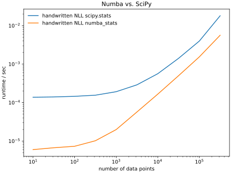
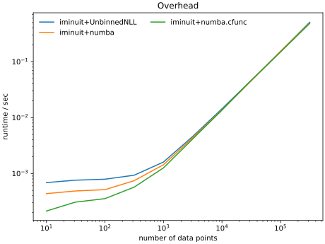
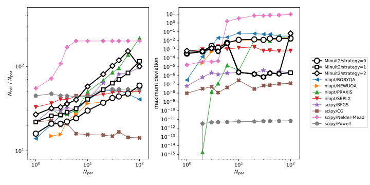
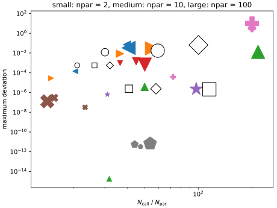

.. include:: bibliography.txt

Benchmarks
==========

Speed of an unbinned fit
------------------------

``iminuit`` comes with a couple of built-in cost functions, but also makes it easy for users to implement their own. One motivation to use your own cost function is to get the best possible performance. If your fit takes more than a minute (possible if you do an unbinned fit on a large sample or if you have a model with many parameters), you may wonder whether there are wells to speed things up. There are, read on.

There are a few simple steps which increase performance without much effort.

- If you have a large sample, use a binned fit instead of an unbinned fit, e.g. :class:`iminuit.cost.BinnedNLL` instead of :class:`iminuit.cost.UnbinnedNLL`. This can easily give you a factor 100 speed-up.
- Use faster implementations of probability densities from `numba_stats`_.
- Use `numba`_ to compile the cost function; try options `parallel=True` and `fastmath=True` to parallelize the computation. This works best if you use the distributions from `numba_stats`_.

Next we show some benchmarks to prove some of these points. The gain of using a binned fit is demonstrated elsewhere, see "Binned vs. unbinned fits" in :ref:`studies`.

For the following benchmarks, we consider a common model in high-energy physics which describes a mixture of two components, a background described by a truncated exponential and a signal described by a normal distribution. The model is fitted to a dataset of varying size using the maximum-likelihood method. Our cost function is the negative sum of log-probabilities.

.. code-block:: python

    import numpy as np
    from numba_stats import norm, truncexpon

    x = ... # data

    def model(x, z, mu, sigma, slope):
        # background is truncated to the observation window [0, 1]
        b = truncexpon.pdf(x, 0, 1, 0, slope)
        s = norm.pdf(x, mu, sigma)
        return (1 - z) * b + z * s

    # handwritten negative log-likelihood
    def nll(z, mu, sigma, slope):
        ll = np.log(model(x, z, mu, sigma, slope))
        return -np.sum(ll)

It is also possible to write down a ``log_model`` computed from the ``logpdf`` functions which are available for the two component distributions, but the code is more complex and the gain is small, so it is not explicitly shown here.

The following plot shows that this cost function computed with pdfs from `numba_stats`_ is much faster than using those from `scipy`_.

It is an order of magnitude for small samples and still a factor of three for very large samples.

Instead of using a handwritten negative log-likelihood, it is convenient to use the built-in class :class:`iminuit.cost.UnbinnedNLL`. This increases the call overhead slightly compared to a handwritten function compiled with `numba`_. The smallest possible overhead is obtained by compiling the function with a ``numba.cfunc`` interface, which ``iminuit`` supports as a special case.

.. code-block:: python

    import numba as nb
    import numpy as np
    from numba_stats import norm, truncexpon

    # mark function for inlining to improve performance
    @nb.njit(inline="always")
    def model(x, z, mu, sigma, slope):
        b = truncexpon.pdf(x, 0, 1, 0, slope)
        s = norm.pdf(x, mu, sigma)
        return (1 - z) * b + z * s

    # Just-in-time-compiled negative log-likelihood
    @nb.njit
    def nll(z, mu, sigma, slope):
        ll = np.log(model(x, z, mu, sigma, slope))
        return -np.sum(ll)

    # as before, but with a cfunc interface
    @nb.cfunc(nb.double(nb.uintc, nb.types.CPointer(nb.double)))
    def nll2(n, par):
        z, mu, sigma, slope = nb.carray(par, (n,))
        ll = np.log(model(x, z, mu, sigma, slope))
        return -np.sum(ll)

The three ways of calling the function are compared in the following plot. The call overhead is only relevant for small samples, where speed is usally no concern. For most users, :class:`iminuit.cost.UnbinnedNLL` incurs a neglible performance loss compared to the best handwritten solution.

A very powerful feature of `numba`_ is auto-parallelization. The distributions in `numba_stats`_ are written so that they benefit optimally from auto-parallelization. To enable this, we only have to change the decorator.

.. code-block:: python

    import numba as nb
    import numpy as np
    from numba_stats import norm, truncexpon

    @nb.njit(parallel=True, fastmath=True)
    def nll(z, mu, sigma, slope):
        ll = np.log(model(x, z, mu, sigma, slope))
        return -np.sum(ll)

The combination ``parallel=True`` and ``fastmath=True`` provides the best performance. Auto-parallelization speeds up the calculation of the cost function over large datasets considerably, but slows it down over small datasets. Only enable it when you profit from it.

The following plot compares the performance of iminuit with `numba`_ JIT'ed NLL functions to an equivalent fit with the `RooFit`_ framework (from ROOT-v6.30/02 installed with ``conda``). RooFit can compute with several backends. The fastest is the ``CPU`` backend, which is comparable to the numba-compiled NLL function. The other backends run slower in this example. RooFit also has a parallel computation mode, but the auto-parallelized NLL function outperforms it by a large margin.

When the dataset is small (< 1000), RooFit is slightly faster due to the Python call overhead, which we previously discussed.

.. image:: _static/roofit_vs_iminuit+numba.svg

Performance hints
^^^^^^^^^^^^^^^^^
- Use the distributions from `numba_stats`_ instead of the `scipy`_ equivalents to get large performance gains.
- Use auto-parallelization to speed up the computation of the cost function for large datasets. Always combine the options `parallel=True` and `fastmath=True`, which allows the compiler to run the parallel computation out-of-order (among other things).
- When the computation is split into several functions, use the option `inline="always"` for the inner `numba.njit` functions. Without inlining, the compiler will miss important global optimization opportunities.
- If you don't need to parallelize the computation, use :class:`iminuit.cost.UnbinnedNLL`. It is likely as good as the fastest function you can write by hand.
- Dramatic (100x) performance gains also be achieved by replacing unbinned fits with binned fits, see `binned vs. unbinned fits`_.

.. _binned vs. unbinned fits: notebooks/binned_vs_unbinned.ipynb

Minuit2 vs other optimisers
---------------------------

We compare the performance of Minuit2 (the code that is wrapped by iminuit) with other minimizers available in Python. We compare Minuit with the strategy settings 0 to 2 with several algorithms implemented in the `nlopt`_ library and `scipy.optimize`_.

All algorithms minimize a dummy cost function

.. code-block:: python

    def cost_function(par):
        z = (y - par)
        return sum(z ** 2 + 0.1 * z ** 4)

where ``y`` are samples from a normal distribution scaled by a factor of 5. The second term in the sum assures that the cost function is non-linear in the parameters and not too easy to minimize. No analytical gradient is provided, since this is the most common way how minimizers are used for small problems.

The cost function is minimized for a variable number of parameters from 1 to 100. The number of function calls is recorded and the largest absolute deviation of the solution from the truth. The fit is repeated 100 times for each configuration to reduce the scatter of the results, and the medians of these trails are computed.

The scipy algorithms are run with default settings. For nlopt, a stopping criterion must be selected. We stop when the absolute variation in the parameters is becomes less than 1e-3.

The results are shown in the following three plots. The best algorithms require the fewest function calls to achieve the highest accuracy.

Shown in the first plot is the number of calls to the cost function divided by the number of parameters. Smaller is better. Note that the algorithms achieve varying levels of accuracy, therefore this plot alone cannot show which algorithm is best. Shown in the second plot is the accuracy of  the solution when the minimizer is stopped. The stopping criteria vary from algorithm to algorithm.

The third plot combines both and shows accuracy vs. number of function calls per parameter for fits with 2, 10, and 100 parameters, as indicated by the marker size. Since higher accuracy can be achieved with more function evaluations, the most efficient algorithms follow diagonal lines from the top left to the bottom right in the lower left edge of the plot.

Discussion
^^^^^^^^^^

The following discussion should be taken with a grain of salt, since experiments have shown that the results depend on the minimisation problem. Also not tested here is the robustness of these algorithms when the cost function is more complicated or not perfectly analytical.

* Minuit2 is average in terms of accuracy vs. efficiency. Strategy 0 is pretty efficient for fits with less than 10 parameters. The typical accuracy achieved in this problem is about 0.1 to 1 %. Experiments with other cost functions have shown that the accuracy strongly depends on how parabolic the function is near the minimum. Minuit2 seems to stop earlier when the function is not parabolic, achieving lower accuracy.

* The scipy methods Powell and CG are the most efficient algorithms on this problem. Both are more accurate than Minuit2 and CG uses much fewer function evaluations, especially in fits with many parameters. Powell uses a similar amount of function calls as Minuit2, but achieves accuracy at the level of 1e-12, while Minuit2 achieves 1e-3 to 1e-6.

* An algorithm with a constant curve in the first plot has a computation time which scales linearly in the number of parameters. This is the case for the Powell and CG methods, but Minuit2 and others that compute an approximation to the Hesse matrix scale quadratically.

* The Nelder-Mead algorithm shows very bad performance with weird features. It should not be used. On the other hand, the SBPLX algorithm does fairly well although it is a variant of the same idea.

In summary, Minuit2 (and therefore iminuit) is a good allrounder, but it is not outstanding in terms of convergence rate or accuracy. Using strategy 0 seem safe to use: it speeds up the convergence without reducing the accuracy of the result. If fast convergence is critical, it can be useful to try others minimisers. The scipy minimisers are accessible through :meth:`iminuit.Minuit.scipy`.
