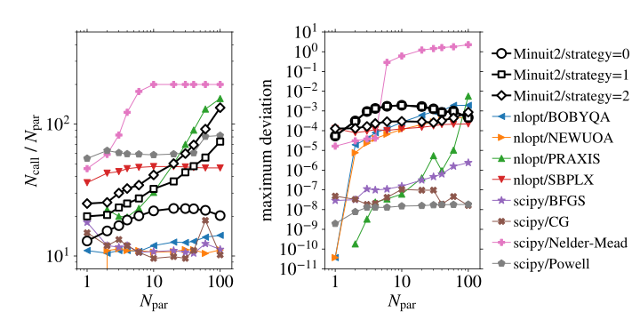
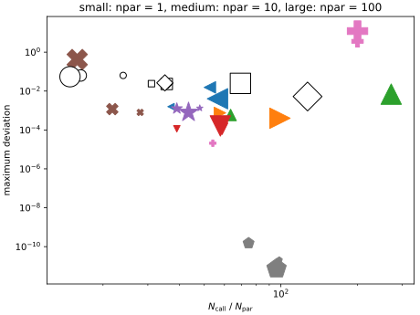

.. include:: references.txt

.. _benchmark:

Benchmark
=========

We compare the performance of Minuit2 (the code that is wrapped by iminuit) with other minimizers available in Python. We compare Minuit with the strategy settings 0 to 2 with several algorithms implemented in the `nlopt`_ library and `scipy.optimize`_. .

Setup
-----

All algorithms minimize a dummy cost function

.. code-block:: python

    def cost_function(par):
        z = (y - par)
        return sum(z ** 2 + 0.1 * z ** 4)

where `y` are samples from a normal distribution scaled by a factor of 5. The second term in the sum assures that the cost function is non-linear in the parameters and not too easy to minimize. No analytical gradient is provided, since this is the most common way how minimizers are used for small problems.

The cost function is minimized for a variable number of parameters from 1 to 100. The number of function calls is recorded and the largest absolute deviation of the solution from the truth. The fit is repeated 100 times for each configuration to reduce the scatter of the results, and the medians of these trails are computed.

The scipy algorithms are run with default settings. For nlopt, a stopping criterion must be selected. We stop when the absolute variation in the parameters is becomes less than 1e-3.

Results
-------

The results are shown in the following three plots. The best algorithms require the fewest function calls to achieve the highest accuracy.

Shown in the first plot is the number of calls to the cost function divided by the number of parameters. Smaller is better. Note that the algorithms achieve varying levels of accuracy, therefore this plot alone cannot show which algorithm is best. Shown in the second plot is the accuracy of  the solution when the minimizer is stopped. The stopping criteria vary from algorithm to algorithm.

The third plot combines both and shows accuracy vs. number of function calls per parameter for fits with 2, 10, and 100 parameters, as indicated by the marker size. Since higher accuracy can be achieved with more function evaluations, the most efficient algorithms follow diagonal lines from the top left to the bottom right in the lower left edge of the plot.

Discussion
----------

The following discussion should be taken with a grain of salt, since experiments have shown that the results depend on the minimisation problem. Also not tested here is the robustness of these algorithms when the cost function is more complicated or not perfectly analytical.

* The Scipy methods Powell and CG are the most efficient algorithms on this problem. Both are more accurate than Minuit2 and CG uses much fewer function evaluations, especially in fits with many parameters. Powell uses a similar amount of function calls as Minuit2, but achieves accuracy at the level of 1e-12, while Minuit2 achieves 1e-3 to 1e-6.

* Minuit2 is average in terms of accuracy vs. efficiency. Strategy 0 is pretty efficient for fits with less than 10 parameters. The typical accuracy achieved in this problem is about 0.1 to 1 %. Experiments with other cost functions have shown that the accuracy strongly depends on how parabolic the function is near the minimum. Minuit2 seems to stop earlier when the function is not parabolic, achieving lower accuracy.

* An algorithm with a constant curve in the first plot has a computation time which scales linearly in the number of parameters. This is the case for the Powell and CG methods, but Minuit2 and others that compute an approximation to the Hesse matrix scale quadratically.

* The Nelder-Mead algorithm shows very bad performance with weird features. It should not be used. On the other hand, the SBPLX algorithm does fairly well although it is a variant of the same idea.

Conclusion
----------

Minuit2 (and therefore iminuit) is a good allrounder. It is not outstanding in terms of convergence rate or accuracy, but not bad either. Using strategy 0 seem safe to use: it speeds up the convergence without reducing the accuracy of the result.

When an application requires minimising the same cost function with different data over and over so that a fast convergence rate is critical, it can be useful to try other minimisers to in addition to iminuit.